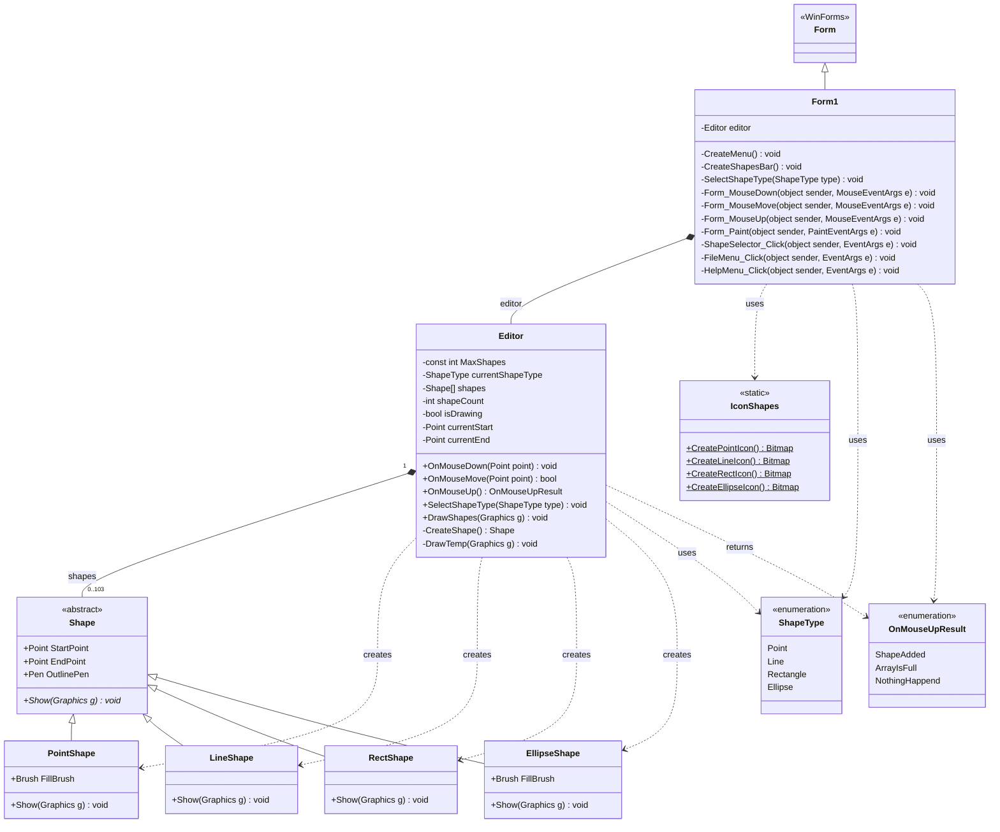

```mermaid
classDiagram
    class Shape {
        <<abstract>>
        +Point StartPoint
        +Point EndPoint
        +Pen OutlinePen
        +Show(Graphics g) void*
    }
    class PointShape {
        +Brush FillBrush
        +Show(Graphics g) void
    }
    class LineShape {
        +Show(Graphics g) void
    }
    class RectShape {
        +Show(Graphics g) void
    }
    class EllipseShape {
        +Brush FillBrush
        +Show(Graphics g) void
    }

    class Editor {
        -const int MaxShapes
        -ShapeType currentShapeType
        -Shape[] shapes
        -int shapeCount
        -bool isDrawing
        -Point currentStart
        -Point currentEnd
        +OnMouseDown(Point point) void
        +OnMouseMove(Point point) bool
        +OnMouseUp() OnMouseUpResult
        +SelectShapeType(ShapeType type) void
        +DrawShapes(Graphics g) void
        -CreateShape() Shape
        -DrawTemp(Graphics g) void
    }
    class ShapeType {
        <<enumeration>>
        Point
        Line
        Rectangle
        Ellipse
    }
    class OnMouseUpResult {
        <<enumeration>>
        ShapeAdded
        ArrayIsFull
        NothingHappend
    }

    class Form {
        <<WinForms>>
    }
    class Form1 {
        -Editor editor
        -CreateMenu() void
        -CreateShapesBar() void
        -SelectShapeType(ShapeType type) void
        -Form_MouseDown(object sender, MouseEventArgs e) void
        -Form_MouseMove(object sender, MouseEventArgs e) void
        -Form_MouseUp(object sender, MouseEventArgs e) void
        -Form_Paint(object sender, PaintEventArgs e) void
        -ShapeSelector_Click(object sender, EventArgs e) void
        -FileMenu_Click(object sender, EventArgs e) void
        -HelpMenu_Click(object sender, EventArgs e) void
    }
    class IconShapes {
        <<static>>
        +CreatePointIcon() Bitmap$
        +CreateLineIcon() Bitmap$
        +CreateRectIcon() Bitmap$
        +CreateEllipseIcon() Bitmap$
    }

    Shape <|-- PointShape
    Shape <|-- LineShape
    Shape <|-- RectShape
    Shape <|-- EllipseShape

    Form <|-- Form1
    Form1 *-- Editor : editor
    Editor "1" *-- "0..103" Shape : shapes

    Editor ..> PointShape : creates
    Editor ..> LineShape : creates
    Editor ..> RectShape : creates
    Editor ..> EllipseShape : creates

    Form1 ..> IconShapes : uses
    Editor ..> ShapeType : uses
    Editor ..> OnMouseUpResult : returns
    Form1 ..> ShapeType : uses
    Form1 ..> OnMouseUpResult : uses
```