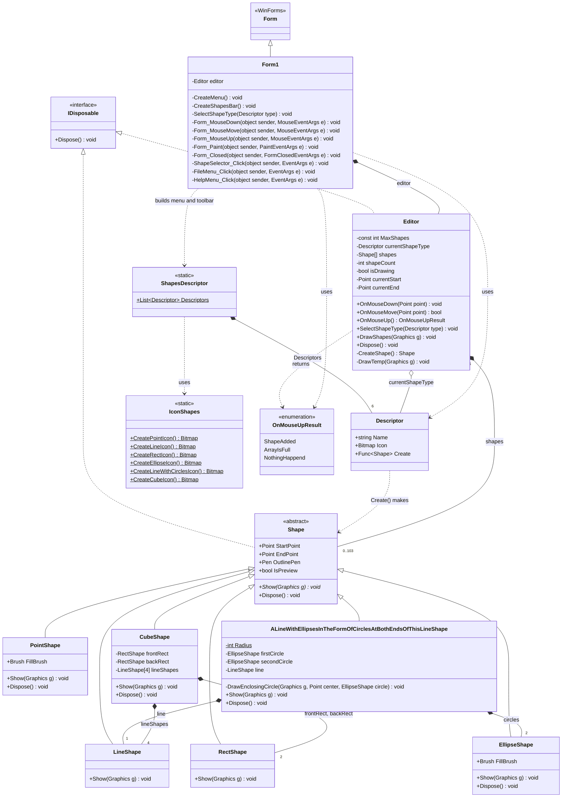

```mermaid
classDiagram
    class IDisposable {
        <<interface>>
        +Dispose() void
    }
 
    class Shape {
        <<abstract>>
        +Point StartPoint
        +Point EndPoint
        +Pen OutlinePen
        +bool IsPreview
        +Show(Graphics g) void*
        +Dispose() void
    }
    class PointShape {
        +Brush FillBrush
        +Show(Graphics g) void
        +Dispose() void
    }
    class LineShape {
        +Show(Graphics g) void
    }
    class RectShape {
        +Show(Graphics g) void
    }
    class EllipseShape {
        +Brush FillBrush
        +Show(Graphics g) void
        +Dispose() void
    }
    class LineWithCircles["ALineWithEllipsesInTheFormOfCirclesAtBothEndsOfThisLineShape"] {
        -int Radius$
        -EllipseShape firstCircle
        -EllipseShape secondCircle
        -LineShape line
        -DrawEnclosingCircle(Graphics g, Point center, EllipseShape circle) void
        +Show(Graphics g) void
        +Dispose() void
    }
    class CubeShape {
        -RectShape frontRect
        -RectShape backRect
        -LineShape[4] lineShapes
        +Show(Graphics g) void
        +Dispose() void
    }
 
    class Descriptor {
        +string Name
        +Bitmap Icon
        +Func~Shape~ Create
    }
    class ShapesDescriptor {
        <<static>>
        +List~Descriptor~ Descriptors$
    }
    class IconShapes {
        <<static>>
        +CreatePointIcon() Bitmap$
        +CreateLineIcon() Bitmap$
        +CreateRectIcon() Bitmap$
        +CreateEllipseIcon() Bitmap$
        +CreateLineWithCirclesIcon() Bitmap$
        +CreateCubeIcon() Bitmap$
    }
 
    class Editor {
        -const int MaxShapes
        -Descriptor currentShapeType
        -Shape[] shapes
        -int shapeCount
        -bool isDrawing
        -Point currentStart
        -Point currentEnd
        +OnMouseDown(Point point) void
        +OnMouseMove(Point point) bool
        +OnMouseUp() OnMouseUpResult
        +SelectShapeType(Descriptor type) void
        +DrawShapes(Graphics g) void
        +Dispose() void
        -CreateShape() Shape
        -DrawTemp(Graphics g) void
    }
    class OnMouseUpResult {
        <<enumeration>>
        ShapeAdded
        ArrayIsFull
        NothingHappend
    }
 
    class Form {
        <<WinForms>>
    }
    class Form1 {
        -Editor editor
        -CreateMenu() void
        -CreateShapesBar() void
        -SelectShapeType(Descriptor type) void
        -Form_MouseDown(object sender, MouseEventArgs e) void
        -Form_MouseMove(object sender, MouseEventArgs e) void
        -Form_MouseUp(object sender, MouseEventArgs e) void
        -Form_Paint(object sender, PaintEventArgs e) void
        -Form_Closed(object sender, FormClosedEventArgs e) void
        -ShapeSelector_Click(object sender, EventArgs e) void
        -FileMenu_Click(object sender, EventArgs e) void
        -HelpMenu_Click(object sender, EventArgs e) void
    }
 
    IDisposable <|.. Shape
    IDisposable <|.. Editor
 
    Shape <|-- PointShape
    Shape <|-- LineShape
    Shape <|-- RectShape
    Shape <|-- EllipseShape
    Shape <|-- LineWithCircles
    Shape <|-- CubeShape
 
    LineWithCircles *-- "1" LineShape : line
    LineWithCircles *-- "2" EllipseShape : circles
    CubeShape *-- "2" RectShape : frontRect, backRect
    CubeShape *-- "4" LineShape : lineShapes
 
    ShapesDescriptor *-- "6" Descriptor : Descriptors
    ShapesDescriptor ..> IconShapes : uses
    Descriptor ..> Shape : Create() makes
 
    Editor "1" *-- "0..103" Shape : shapes
    Editor o-- Descriptor : currentShapeType
    Editor ..> OnMouseUpResult : returns
 
    Form <|-- Form1
    Form1 *-- Editor : editor
    Form1 ..> ShapesDescriptor : builds menu and toolbar
    Form1 ..> Descriptor : uses
    Form1 ..> OnMouseUpResult : uses
```