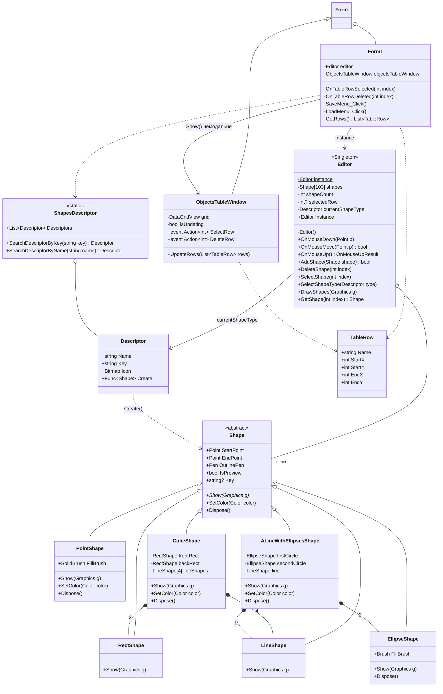

```mermaid
classDiagram
direction TB

class Shape {
    <<abstract>>
    +Point StartPoint
    +Point EndPoint
    +Pen OutlinePen
    +bool IsPreview
    +string? Key
    +Show(Graphics g)*
    +SetColor(Color color)
    +Dispose()
}

class PointShape {
    +SolidBrush FillBrush
    +Show(Graphics g)
    +SetColor(Color color)
    +Dispose()
}
class LineShape {
    +Show(Graphics g)
}
class RectShape {
    +Show(Graphics g)
}
class EllipseShape {
    +Brush FillBrush
    +Show(Graphics g)
    +Dispose()
}
class CubeShape {
    -RectShape frontRect
    -RectShape backRect
    -LineShape[4] lineShapes
    +Show(Graphics g)
    +SetColor(Color color)
    +Dispose()
}
class ALineWithEllipsesShape {
    -EllipseShape firstCircle
    -EllipseShape secondCircle
    -LineShape line
    +Show(Graphics g)
    +SetColor(Color color)
    +Dispose()
}

Shape <|-- PointShape
Shape <|-- LineShape
Shape <|-- RectShape
Shape <|-- EllipseShape
Shape <|-- CubeShape
Shape <|-- ALineWithEllipsesShape

CubeShape *-- RectShape : 2
CubeShape *-- LineShape : 4
ALineWithEllipsesShape *-- EllipseShape : 2
ALineWithEllipsesShape *-- LineShape : 1

class Editor {
    <<Singleton>>
    -Editor instance$
    -Shape[103] shapes
    -int shapeCount
    -int? selectedRow
    -Descriptor currentShapeType
    -Editor()
    +Editor Instance$
    +OnMouseDown(Point p)
    +OnMouseMove(Point p) bool
    +OnMouseUp() OnMouseUpResult
    +AddShape(Shape shape) bool
    +DeleteShape(int index)
    +SelectShape(int index)
    +SelectShapeType(Descriptor type)
    +DrawShapes(Graphics g)
    +GetShape(int index) Shape
}

class Descriptor {
    +string Name
    +string Key
    +Bitmap Icon
    +Func~Shape~ Create
}

class ShapesDescriptor {
    <<static>>
    +List~Descriptor~ Descriptors
    +SearchDescriptorByKey(string key) Descriptor
    +SearchDescriptorByName(string name) Descriptor
}

Editor o-- "0..103" Shape
Editor --> Descriptor : currentShapeType
Descriptor ..> Shape : Create()
ShapesDescriptor o-- Descriptor

class Form
class Form1 {
    -Editor editor
    -ObjectsTableWindow objectsTableWindow
    -OnTableRowSelected(int index)
    -OnTableRowDeleted(int index)
    -SaveMenu_Click()
    -LoadMenu_Click()
    -GetRows() List~TableRow~
}

class ObjectsTableWindow {
    -DataGridView grid
    -bool isUpdating
    +event Action~int~ SelectRow
    +event Action~int~ DeleteRow
    +UpdateRows(List~TableRow~ rows)
}

class TableRow {
    +string Name
    +int StartX
    +int StartY
    +int EndX
    +int EndY
}

Form <|-- Form1
Form <|-- ObjectsTableWindow
Form1 --> Editor : Instance
Form1 --> ObjectsTableWindow : Show() немодальне
Form1 ..> ShapesDescriptor
Form1 ..> TableRow
ObjectsTableWindow ..> TableRow
```