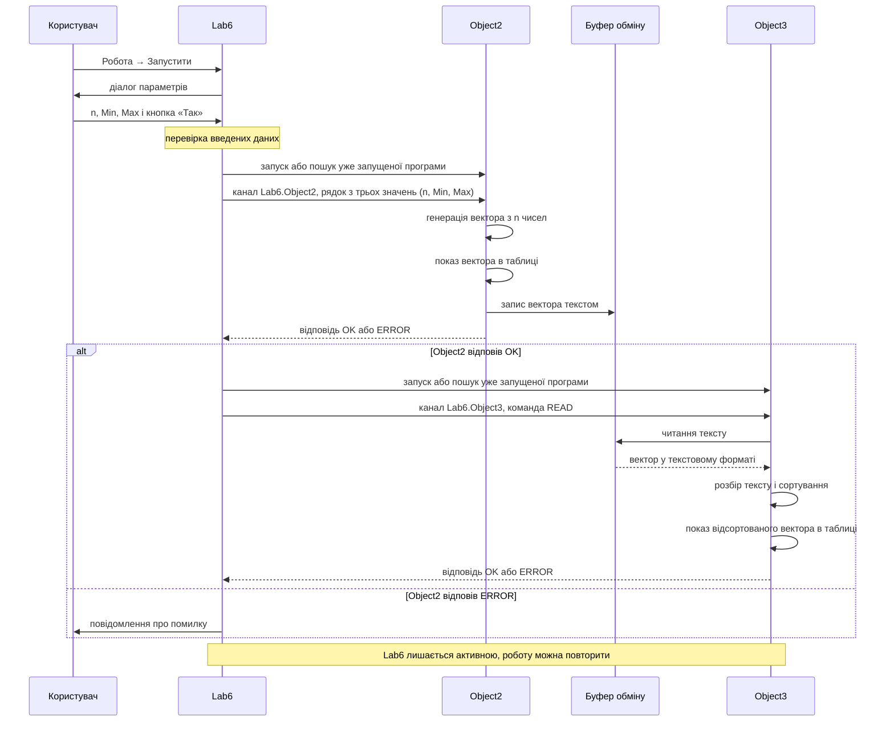

```mermaid
sequenceDiagram
    participant User as Користувач
    participant Lab6
    participant Object2
    participant Clipboard as Буфер обміну
    participant Object3

    User->>Lab6: Робота → Запустити
    Lab6->>User: діалог параметрів
    User->>Lab6: n, Min, Max і кнопка «Так»
    Note over Lab6: перевірка введених даних

    Lab6->>Object2: запуск або пошук уже запущеної програми
    Lab6->>Object2: канал Lab6.Object2, рядок з трьох значень (n, Min, Max)
    Object2->>Object2: генерація вектора з n чисел
    Object2->>Object2: показ вектора в таблиці
    Object2->>Clipboard: запис вектора текстом
    Object2-->>Lab6: відповідь OK або ERROR

    alt Object2 відповів OK
        Lab6->>Object3: запуск або пошук уже запущеної програми
        Lab6->>Object3: канал Lab6.Object3, команда READ
        Object3->>Clipboard: читання тексту
        Clipboard-->>Object3: вектор у текстовому форматі
        Object3->>Object3: розбір тексту і сортування
        Object3->>Object3: показ відсортованого вектора в таблиці
        Object3-->>Lab6: відповідь OK або ERROR
    else Object2 відповів ERROR
        Lab6->>User: повідомлення про помилку
    end

    Note over Lab6,Object3: Lab6 лишається активною, роботу можна повторити
```